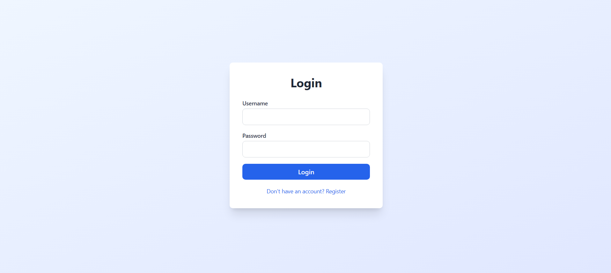
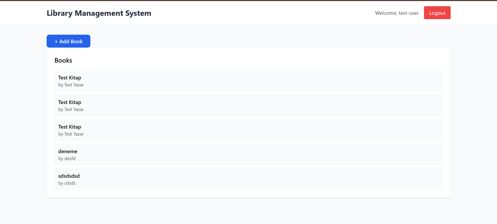

# 📚 Library Management System

A full-stack library management system with secure JWT authentication and a modern frontend UI.

---

## 📸 Screenshots

## 🚀 Features

### ✅ Frontend
- Login & Register forms
- JWT token management (stored in localStorage)
- Protected routes (Dashboard)
- Token persistence after page refresh
- Modern UI built with Tailwind CSS

### ✅ Backend
- JWT Authentication
- RESTful API
- Dockerized backend
- PostgreSQL database
- Unit tests
- Production-ready configuration

---

## 🛠️ Tech Stack

**Backend:**
- Java 17
- Spring Boot
- Spring Security (JWT)
- PostgreSQL
- Docker

**Frontend:**
- React
- Tailwind CSS
- Axios

---

