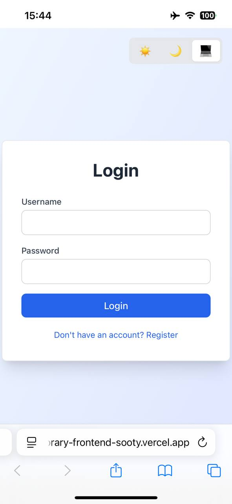
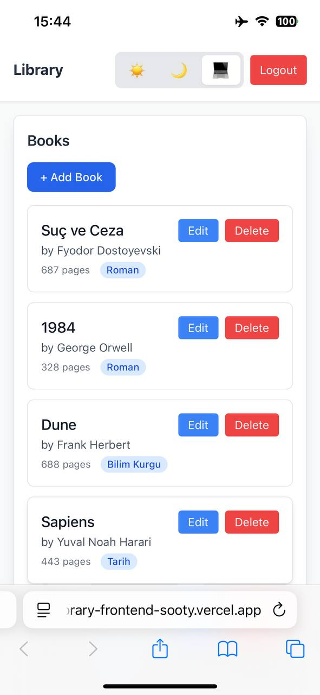
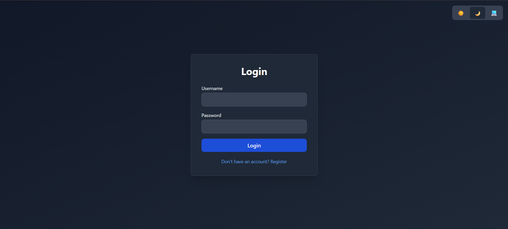
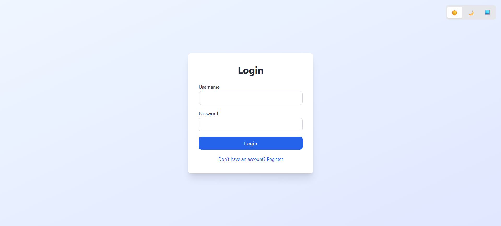
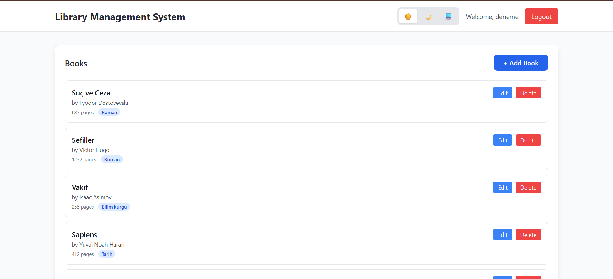

# Library Management System

A modern full-stack web application for managing library books with secure JWT authentication, featuring dark mode support and containerized deployment.


## 🌐 Live Demo

The frontend application is live:  
👉 https://library-frontend-sooty.vercel.app/

## 🔐 Test Login

You can use the following test account to log in and try the application:

- **Username:** `test-user`
- **Password:** `123456`


## 📸 Screenshots

## 📱 Mobile 

| Login Screen | Books Screen |
|-------------|--------------|
| | |

### Dark Mode

*Dashboard with book management features in dark mode*

*Clean and modern login interface with theme toggle*

### Light Mode


*Light mode dashboard with category badges*


## 🚀 Features

### Backend
- ✅ **JWT Authentication** - Secure user registration and login with BCrypt password hashing
- ✅ **RESTful API** - Full CRUD operations for book management
- ✅ **Spring Security** - Role-based access control with stateless sessions
- ✅ **PostgreSQL** - Relational database with JPA/Hibernate ORM
- ✅ **Docker Support** - Containerized application with Docker Compose
- ✅ **Unit Tests** - JUnit & Mockito test coverage
- ✅ **Global Exception Handling** - Consistent error responses
- ✅ **Category Management** - Books organized by categories

### Frontend
- ✅ **React + TypeScript** - Type-safe component development
- ✅ **Dark Mode** - Light/Dark/System theme support with persistent preferences
- ✅ **Vite** - Fast build tool with Hot Module Replacement
- ✅ **JWT Token Management** - Secure API communication with localStorage
- ✅ **Real-time Notifications** - Toast notifications for user feedback
- ✅ **Responsive Design** - Modern UI/UX with Tailwind CSS
- ✅ **Loading States** - Smooth user experience with spinners
- ✅ **Inline Editing** - Edit books directly in the list

## 🛠️ Tech Stack

### Backend
- **Framework:** Spring Boot 3.3.4
- **Language:** Java 17
- **Security:** Spring Security + JWT (jjwt 0.12.3)
- **Database:** PostgreSQL 15
- **ORM:** Hibernate/JPA
- **Build Tool:** Maven
- **Testing:** JUnit 5, Mockito

### Frontend
- **Framework:** React 18
- **Language:** TypeScript 5
- **Styling:** Tailwind CSS 3
- **Build Tool:** Vite
- **State Management:** React Hooks
- **Notifications:** react-hot-toast

### DevOps
- **Containerization:** Docker & Docker Compose
- **Database:** PostgreSQL (containerized)

## 📋 Prerequisites

- Docker Desktop installed and running
- Git

## 🚀 Quick Start

### 1. Clone the repository
```bash
git clone https://github.com/Mehmetkrks09/spring-react-library-management.git
cd spring-react-library-management
```

### 2. Start Backend with Docker Compose
```bash
docker-compose up -d
```

This will start:
- Backend API on `http://localhost:8080`
- PostgreSQL database on `localhost:5432`

### 3. Run Frontend (Development)
```bash
cd library-frontend
npm install
npm run dev
```

Frontend will be available at `http://localhost:5173`

### 4. Create a User
- Navigate to `http://localhost:5173`
- Click "Don't have an account? Register"
- Create your account and login

## 📡 API Endpoints

### Authentication
```
POST /api/auth/register - Register new user
POST /api/auth/login    - Login and get JWT token
```

### Books (Protected - Requires JWT)
```
GET    /api/kitaplar              - Get all books
GET    /api/kitaplar/{id}         - Get book by ID
GET    /api/kitaplar/kategori/{id} - Get books by category
POST   /api/kitaplar/addBook      - Add new book
PUT    /api/kitaplar/update/{id}  - Update book
DELETE /api/kitaplar/delete/{id}  - Delete book
```

### Categories (Protected - Requires JWT)
```
GET    /api/kategoriler           - Get all categories
POST   /api/kategoriler/addCategory - Add new category
PUT    /api/kategoriler/update/{id} - Update category
DELETE /api/kategoriler/delete/{id} - Delete category
```

### Example: Login Request
```bash
curl -X POST http://localhost:8080/api/auth/login \
  -H "Content-Type: application/json" \
  -d '{
    "username": "testuser",
    "password": "password123"
  }'
```

### Example: Protected Request
```bash
curl -X GET http://localhost:8080/api/kitaplar \
  -H "Authorization: Bearer YOUR_JWT_TOKEN"
```

## 🏗️ Project Structure

```
.
├── backend/
│   ├── src/main/java/com/ders/kutuphane/
│   │   ├── controller/     # REST controllers
│   │   ├── service/        # Business logic
│   │   ├── repository/     # Data access layer
│   │   ├── entity/         # JPA entities
│   │   ├── dto/            # Data transfer objects
│   │   ├── security/       # JWT & Security config
│   │   └── exception/      # Exception handlers
│   ├── src/test/           # Unit tests
│   └── pom.xml
├── library-frontend/
│   ├── src/
│   │   ├── components/     # React components
│   │   ├── hooks/          # Custom hooks (theme management)
│   │   ├── App.tsx         # Main component
│   │   └── main.tsx        # Entry point
│   └── package.json
├── docker-compose.yml
├── Dockerfile
└── README.md
```

## 🔒 Security Features

- **Password Hashing:** BCrypt algorithm for secure password storage
- **JWT Tokens:** 24-hour expiration with secure token generation
- **CORS Configuration:** Configured for frontend origin
- **Protected Endpoints:** All book operations require authentication
- **Role-Based Access:** USER and ADMIN roles supported
- **Stateless Sessions:** No server-side session storage

## 🧪 Running Tests

```bash
# Backend tests
mvn test

# Frontend tests (if configured)
cd library-frontend
npm test
```

## 🛑 Stopping the Application

```bash
docker-compose down
```

To remove volumes (database data):
```bash
docker-compose down -v
```

## 📝 Environment Variables

### Backend (configured in docker-compose.yml)
```yaml
SPRING_DATASOURCE_URL: jdbc:postgresql://postgres:5432/kutuphane_db
SPRING_DATASOURCE_USERNAME: postgres
SPRING_DATASOURCE_PASSWORD: 4464
```

### Frontend (.env file)
```
VITE_API_URL=http://localhost:8080
```

## 🔄 Development Workflow

### Backend Development
1. Make code changes in your IDE
2. Rebuild Docker image:
```bash
docker-compose down
docker-compose up --build
```

### Frontend Development
- Vite HMR automatically reloads changes
- No need to restart the dev server
- Change theme with toggle (persists across sessions)

## 🎨 Features Showcase

### Dark Mode
- **3 Theme Options:** Light, Dark, System (follows OS preference)
- **Persistent Storage:** Theme preference saved in localStorage
- **Smooth Transitions:** CSS transitions for theme changes
- **Complete Coverage:** All pages and components support dark mode

### Toast Notifications
- Success messages for CRUD operations
- Error handling with user-friendly messages
- Non-intrusive design

### Responsive Design
- Mobile-friendly interface
- Adaptive layouts for different screen sizes
- Touch-optimized controls

## 📚 Key Learning Outcomes

This project demonstrates:
- **Full-Stack Development:** Complete integration of frontend and backend
- **Modern Authentication:** JWT-based stateless authentication
- **Containerization:** Docker and Docker Compose for deployment
- **Type Safety:** TypeScript for frontend development
- **RESTful API Design:** Best practices for API development
- **Security Best Practices:** Password hashing, CORS, token management
- **Modern UI/UX:** Dark mode, responsive design, loading states

## 🤝 Contributing

This is a portfolio project showcasing full-stack development skills. Feedback and suggestions are welcome!

## 📄 License

This project is open source and available under the MIT License.

## 👤 Author

**Mehmet Karakaş**
- Location: Didim, Aydın, Turkey
- Email: mehmetkarakas415@gmail.com
- GitHub: [@Mehmetkrks09](https://github.com/Mehmetkrks09)
- LinkedIn: [@Mehmet Karakaş](https://www.linkedin.com/in/mehmet-karaka%C5%9F/)

---

**Built with ❤️ using Spring Boot, React, and Docker**

*This project is part of my portfolio demonstrating modern full-stack development practices and clean code principles.*
